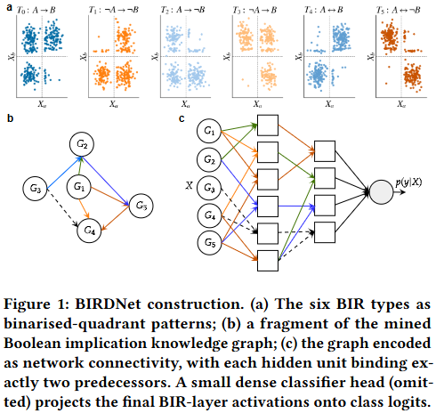

# BIRDNet

Code for the paper:

> Tirtharaj Dash. *BIRDNet: Mining and Encoding Boolean Implication Knowledge Graphs as Interpretable Deep Neural Networks*. arXiv:2605.28739, 2026. [doi.org/10.48550/arXiv.2605.28739](https://doi.org/10.48550/arXiv.2605.28739)

<p align="center">
  
</p>

BIRDNet mines Boolean Implication Relationships (BIRs) from tabular data via a sparse-exception binomial test and encodes them as the connectivity of a layered neural network. Each hidden unit corresponds to one mined two-literal rule and binds only to its two input features, giving a model that is sparse by construction and whose rules can be read directly off the trained weights, without surrogate explainers.

A plain-language summary of the paper is available at [Gist.Science](https://gist.science/paper/2605.28739) (author-reviewed).

## Setup

A conda environment is supplied in `env.yml`. This is a shared environment used across several projects, so it pulls in more than is strictly needed. The core requirements are `pytorch`, `numpy`, `scipy`, `scikit-learn`, `pandas`, `joblib`, and `openpyxl`; version pins are visible in `env.yml`.

```bash
conda env create -f env.yml
conda activate <env-name>
```

## Datasets

Six benchmarks: two proteomic (UCI Mice Protein, TCGA RPPA) and four transcriptomic (UCI Gene Expression / TCGA PANCAN, GSE39582, METABRIC, TCGA RNA-seq). See the paper for sources and preprocessing. The raw files are not redistributed here due to size and access restrictions (METABRIC in particular requires accepting cBioPortal terms); a download helper will follow.

## Running

```bash
./run.sh                                       # all six datasets
python run_experiments.py --dataset gse39582   # single dataset
```

Each call writes to `saved_models/<Model>/<timestamp>_<dataset>/` and a per-dataset log to `logs/`. A run contains per-fold `metrics.json`, `architecture.json`, `model.pt`, and an aggregate `cv_summary.json`. The BIRDNet runs additionally save `bir_stats.json` and a final 80/20 model under `final_8020/`.

Reload a saved run for inference or explanation:

```bash
python load_run.py --dataset gse39582 --fold 0
```

Note: reloading is sensitive to architecture metadata; if `architecture.json` and `model.pt` are out of sync (e.g., loaded across a code change), reconstruction will fail. Re-run rather than patch.

## Hardware

All reported experiments were run on an Ubuntu machine with a 12-core AMD CPU, 64 GB RAM, and an NVIDIA RTX 4500 Ada (24 GB).

## Repository layout

| File / Directory     | Description                                       |
|----------------------|---------------------------------------------------|
| `bir.py`             | StepMiner binarisation and BIR computation        |
| `model.py`           | BIRLayer, BIRDNet, greedy construction            |
| `train.py`           | Training loop, evaluation                         |
| `baselines.py`       | Matched dense MLP and random-edge ablation        |
| `explain.py`         | Feature / unit importance, BIR graph extraction   |
| `rules.py`           | Propositionalisation and per-class decision rules |
| `lrp.py`             | Layer-wise relevance propagation                  |
| `experiment_io.py`   | Run-directory IO, deterministic seeding           |
| `load_run.py`        | Reload saved runs                                 |
| `run_experiments.py` | Main experiment runner                            |
| `data_loaders/`      | One module per dataset                            |
| `scripts/`           | Figure generation                                 |
| `logs/`              | Run logs for individual datasets                  |

## Citation

If you use this code, please cite the paper (see `CITATION.cff`):

```bibtex
@article{dash2026birdnet,
  title   = {{BIRDNet}: Mining and Encoding {Boolean} Implication Knowledge Graphs as Interpretable Deep Neural Networks},
  author  = {Dash, Tirtharaj},
  journal = {arXiv preprint arXiv:2605.28739},
  year    = {2026},
  doi     = {10.48550/arXiv.2605.28739}
}
```

## License

Apache-2.0. See `LICENSE`.